# 使用vue+express校园考勤项目
lt -s midea  -p 9528
[TOC]

## 一、vue开发环境搭建

```
// cd到本地项目下
cd vue_campus_face

// 安装项目运行需要的依赖包
npm install

// 在本地开发时，运行项目
npm run dev 

```
开发环境，在执行完上述步骤后，浏览器访问http://localhost:9528

### 1.项目文件目录

```

│  .editorconfig
│  .env.development
│  .env.production
│  .env.staging
│  .eslintignore
│  .eslintrc.js
│  .travis.yml
│  babel.config.js
│  jest.config.js
│  jsconfig.json
│  LICENSE
│  package-lock.json
│  package.json   --前端需要的下载的包
│  plopfile.js
│  postcss.config.js
│  README.md
│  vue.config.js     --配置跨域等信息
│  favicon.ico
├─build
│      index.js
│                      
├─public
│      favicon.ico --图标
│      index.html 
│      
├─server            --后端api
│  │  app.js       --后端接口api启动文件
│  │  package-lock.json
│  │  package.json    --后端需要下载的包
│  │  pm2.json
│  │  
│  ├─aip-node-sdk-2.3.1    --百度人脸识别离线sdk
│  │  │  package-lock.json
│  │  │  package.json
│  │  │  README.md
│  │  │  

	| | model    --与数据库进行orm映射的模型   （表）
      Allmodel.js
    attend_records.js
    config.js
    faces.js
    init.js
    location.js
    menus.js
    random.js
    rolesmodel.js
    stuinfo.js
    teaandstu.js
    teainfo.js
    user-logs.js
    users.js
    usersandroles.js
│    
│  ├─public   --存放静态目录的文件夹，可以用来存放图片，xls,各种静态资源，在浏览器可以通过url地址访问
│  │  ├─images   --图片资源
│  │  │  ├─face
│  │  │  │      zlk0987.jpg
│  │  │  │      钥匙.png
│  │  │  │      
│  │  │  └─random    
│  │  │          a.jpg
│  │  │          
│  │  ├─js
│  │  │      role.js
│  │  │      
│  │  ├─tmp
│  │  ├─xlsexcel
│  │  │     
│  │  │      
│  │  └─xlstempfile
│  │          stu_multiply_template.xls   --学生批量上传xls模板
│  │          tea_template.xls   --批量上传教师数据xls模板
│  │          
│  ├─router 
│  │      faceRouter.js   --人脸识别路由
│  │      index.js			
│  │      locaRouter.js   
│  │      menuRoute.js     --获取动态目录路由
│  │      randomRouyer.js		
│  │      roleRoutr.js			--角色路由
│  │      stuRoyute.js			--学生相关接口路由	
│  │      teaRoute.js			--教师路由
│  │      user-logRouter.js			--用户日志
│  │      userRouter.js			--登陆
│  │      
│  ├─static
│  │      a.js  --测试文件
│  │      
│  └─utils
│          sendMail.js    --发送邮件
│          tools.js      --工具类
│          vue_campus.sql     --sql语句
│          
└─src                    --------前端入口文件
    │  App.vue    --总入口文件
    │  main.js		--挂载
    │  permission.js  
    │  settings.js
    │  
    ├─api 					--请求封装
    │  │  user.js   
    │  │  
    │  ├─present
    │  │      face.js			--人脸签到请求
    │  │      location.js
    │  │      random.js
    │  │      stuapi.js			--学生请求
    │  │      teaapi.js				--教师
    │  │      
    │  └─system
    │          menu.js			--目录获取
    │          role.js			--角色
    │          user-log.js
    │          user.js
    │          
    ├─assets
    │  ├─401_images
    │  │      401.gif
    │  │      
    │  ├─404_images
    │  │      404.png
    │  │      404_cloud.png
    │  │      
    │  └─custom-theme
    │      │  index.css
    │      │  
    │      └─fonts
    │              element-icons.ttf
    │              element-icons.woff
    │              
    ├─components			----公用组件目录
    │  ├─BackToTop
    │  │      index.vue
    │  │      
    │  ├─Breadcrumb
    │  │      index.vue
    │  │      
    │  ├─Hamburger
    │  │      index.vue
    │  │      
    │  ├─HeaderSearch
    │  │      index.vue
    │  │      
    │  ├─IconSelect
    │  │      index.vue
    │  │      requireIcons.js
    │  │      
    │  ├─Pagination
    │  │      index.vue
    │  │      
    │  ├─RightPanel
    │  │      index.vue
    │  │      
    │  ├─Screenfull
    │  │      index.vue
    │  │      
    │  ├─SizeSelect
    │  │      index.vue
    │  │      
    │  ├─SvgIcon
    │  │      index.vue
    │  │      
    │  ├─TextHoverEffect
    │  │      Mallki.vue
    │  │      
    │  └─ThemePicker
    │          index.vue
    │          
    ├─directive
    │  └─permission   --自定义指令
    │          index.js
    │          permission.js
    │          
    ├─filters
    │      index.js
    │      
    ├─icons
    │  │  index.js
    │  │  svgo.yml
    │  │  
    │  └─svg
    │         
    │         
    │          
    ├─layout
    │  │  index.vue
    │  │  
    │  ├─components
    │  │  │  AppMain.vue
    │  │  │  index.js
    │  │  │  Navbar.vue
    │  │  │  
    │  │  ├─Settings
    │  │  │      index.vue
    │  │  │      
    │  │  ├─Sidebar
    │  │  │      FixiOSBug.js
    │  │  │      index.vue
    │  │  │      Item.vue
    │  │  │      Link.vue
    │  │  │      Logo.vue
    │  │  │      SidebarItem.vue
    │  │  │      
    │  │  └─TagsView
    │  │          index.vue
    │  │          ScrollPane.vue
    │  │          
    │  └─mixin
    │          ResizeHandler.js
    │          
    ├─router
    │      index.js    --前端路由
    │      
    ├─store    --vuex
    │  │  getters.js
    │  │  index.js
    │  │  
    │  └─modules
    │          app.js
    │      
    │          permission.js
    │          settings.js
    │          tagsView.js
    │          user.js
    │          
    ├─styles
    │      btn.scss
    │      element-ui.scss
    │      element-variables.scss
    │      index.scss
    │      mixin.scss
    │      sidebar.scss
    │      transition.scss
    │      variables.scss
    │      
    ├─utils
    │      auth.js
    │      costum.js
    │      get-page-title.js
    │      index.js
    │      open-window.js
    │      permission.js
    │      request.js
    │      scroll-to.js
    │      validate.js
    │      
    └─views
        ├─dashboard
        │  │  index.vue
        │  │  
        │  └─components
        │      └─mixins
        │              resize.js

        │              
        ├─error-page
        │      401.vue
        │      404.vue
        │      
        ├─login
        │      auth-redirect.vue
        │      index.vue
        │      
        ├─present
        │  ├─face
        │  │      index.vue --人脸签到
        │  │      
        │  ├─location
        │  │      index.vue
        │  │      
        │  └─random
        │          index.vue
        │          
        ├─redirect
        │      index.vue  
        │      
        └─system
            ├─log
            │      index.vue    --用户日志
            │      
            ├─menu
            │      index.vue    --获取目录
            │      
            ├─role
            │      index.vue   --获取角色
            │      
            ├─stuinfo
            │      index.vue   --学生信息
            │      
            ├─teainfo
            │      index.vue  --教师信息
            │      
            └─user
                    index.vue   --用户管理
                    

```


## 二、node.js服务器开发环境搭建

```
cd vue_campus_face cd server

// 安装项目运行需要的依赖包
npm install

// 在本地开发时，运行项目
npm run start /node app.js   nodemon app.js

```

开发环境，在执行完上述步骤后，浏览器访问http://localhost:8002

## 三、MySQL数据库

如使用自己服务器数据库，需要安装MySQL
```
1.数据库配置文件在server->model=>init.js   需要修改成自己的

const sequelize = new Sequelize(
  'flask_fa', // 数据库名
  'root', // 用户名

  'root', // 密码
  {
    'dialect': 'mysql', // 数据库类型
    'host': '127.0.0.1', // ip
    'port': 3306, // 端口
    define: {
        // freezeTableName:true,    //自定义表名，不设置会自动将表名转为复数形式
        timestamps:false    //自动生成更新时间，创建时间字段，updatedAt,createdAt

    },
        dialectOptions:{
        charset:'utf8mb4',  //字符集
        collate:'utf8mb4_unicode_ci'
    },
    timezone: '+08:00' // 东八时区

  },

)
2.在server->model=>config.js   需要修改成自己的
由于使用orm库有的功能踩到了一些坑，所以使用原始sql查询实现部分功能
let options = {
    host:"localhost",
    //port:"3306",//可选，默认式3306
    user:"root",
    password:"root",
    database:"flask_fa"

}
3.数据库文件sql放在  vue_campus.sql
自行创建数据库sql   将该sql语句导入数据库即可正常使用

```

数据库表如下图

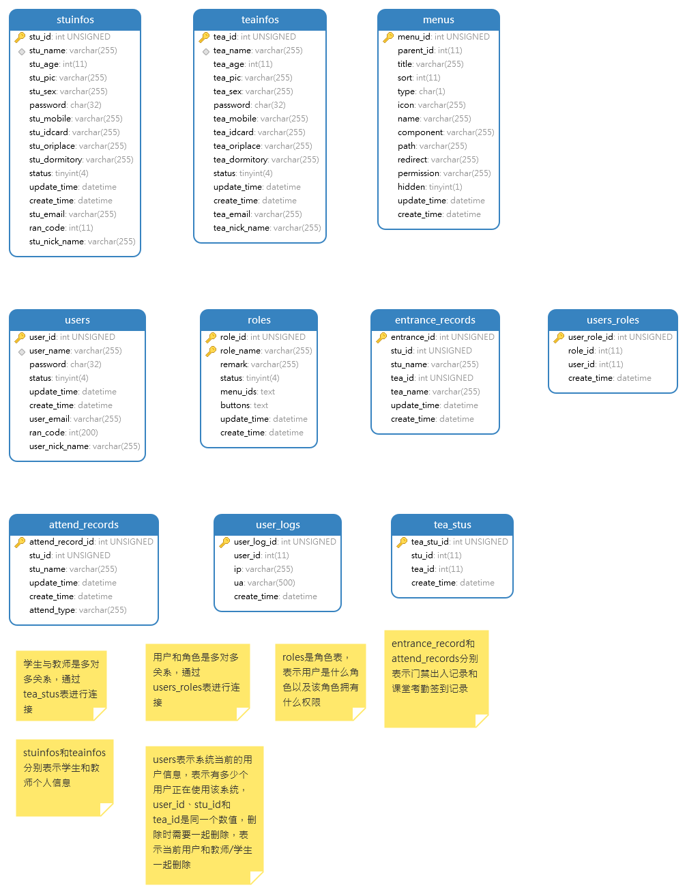


## 四、项目截图

#### 项目总览功能结构

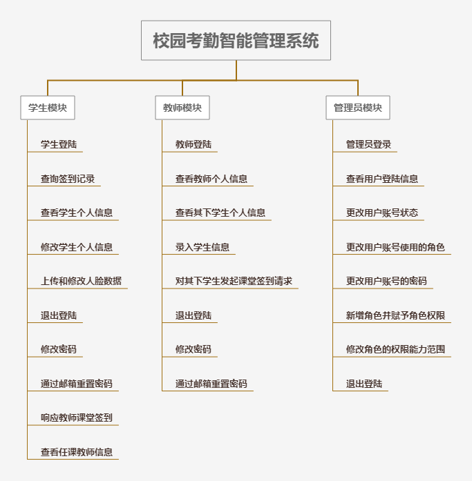


### （1）admin

#### 1.登陆界面

使用群体分为三类，系统比较封闭，没有注册按钮，只有登陆功能，分别是

管理员：管理员目前只有一个，是提前录入的，不可以编辑不可修改不可以删除，是用来添加录入教师信息

教师：添加录入学生信息，同时会将自己的id或者账号传递到数据库，通过账号找到id，通过教师id与学生绑定，教师和学生是多对多关系

学生：只能登陆，进行登陆考勤，没有被教师录入信息的学生无法登陆该系统

#### 用户密码tips:

所有用户的密码经过Md5加密，密码如果不是123就是和用户账号一样，比如账号是zpl密码就是zpl，建议在录入信息的时候不要只录入用户姓名的缩写，防止账号重复，可以在账号后加一点数字比如手机号后四位，如果有更好的账号命名方式可以自己挖掘，其中admin账号密码就是123，有了admin账号其他角色账号都可以生成

登陆流程：

获取到用户名和密码后先进行users表的查找是否存在用户以及用户状态是否启用，错误的话返回错误信息

将获取到的密码加密与数据库中的密码进行比对，比对成功生成token,将用户Id和账号压入token中，密码比对不成功则返回错误信息

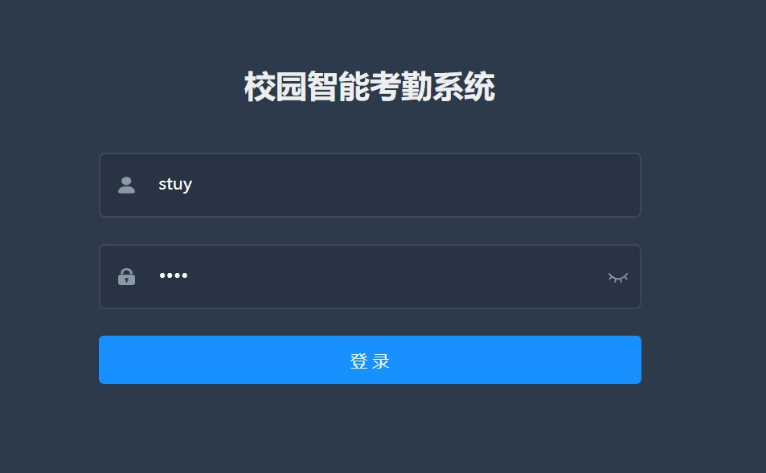

2.查看用户登陆信息

管理员权限：登陆查看用户信息

信息在后端动态存储，其中包括：

角色信息

用户Id

用户邮箱

用户真实姓名

用户账号名

目录

按钮

前端通过访问user/info接口传入登陆时的token,将以上数据保存在vuex里，动态获取目录、按钮、信息、id等，在这次用户登陆期间有效，用户登出之后信息全部销毁，token重置，使用vuex保存后端传递的用户数据，可以方便的在各个组件之间互通有无，例如在教师单个添加学生表单信息时候，可以获取到当前登陆的教师id,将当前登陆的教师id可以直接从vuex中获取，并发送到后端与学生进行绑定

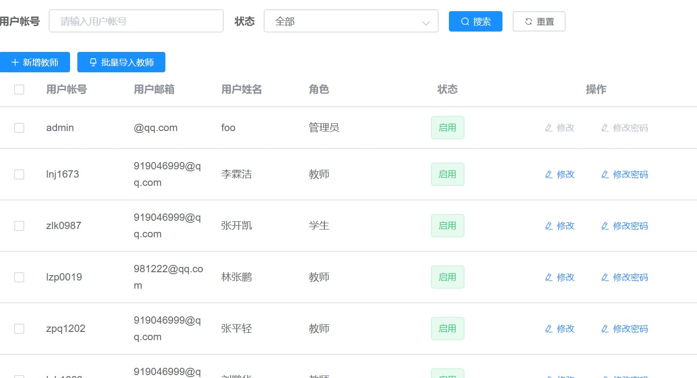

#### 2.登陆界面首页


#### 3.单个添加教师信息

直接添加即可，密码默认为123，加密后存储到数据库中

该操作涉及了用户表和教师表的插入，一条插入成功后才可以进行下一张表的插入

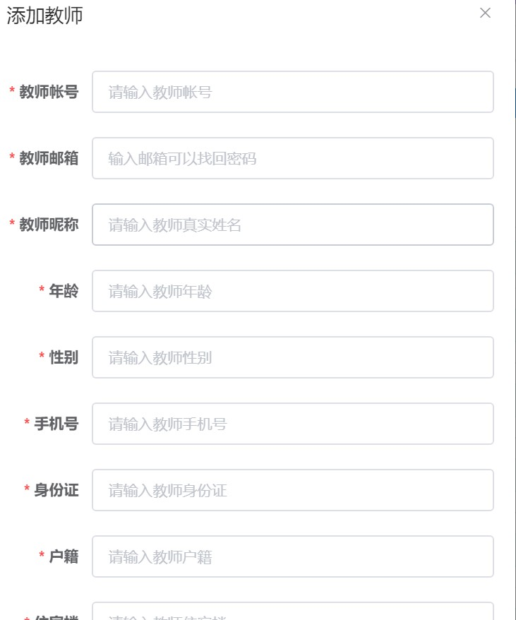

#### 4.批量添加教师信息

批量添加需要先下载模板，模板信息如下

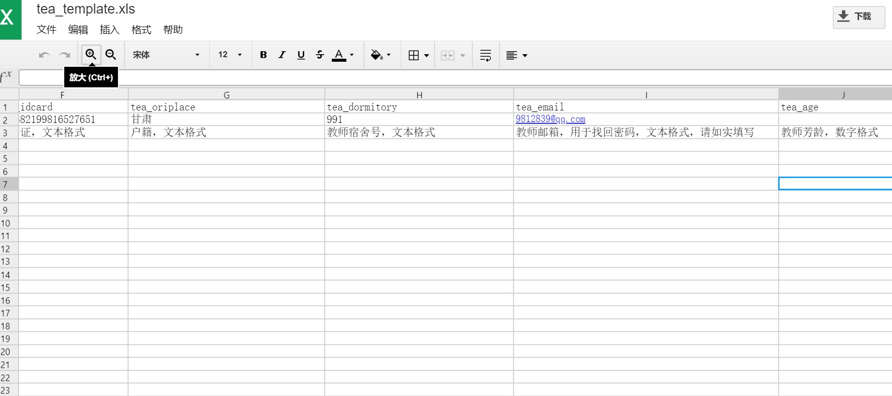

严格按照模板修改信息，然后上传xls文件即可批量添加教师信息，其中每个字段的表头是与数据库对应的字段名称，表头无法修改，模板更改完毕后将下面的提示信息删除，api端会收到xls文件，并且将xls文件转换成多个json对象的数组，对数组进行map遍历，往教师表，用户表，用户-角色表插入多条记录，实现批量导入教师信息


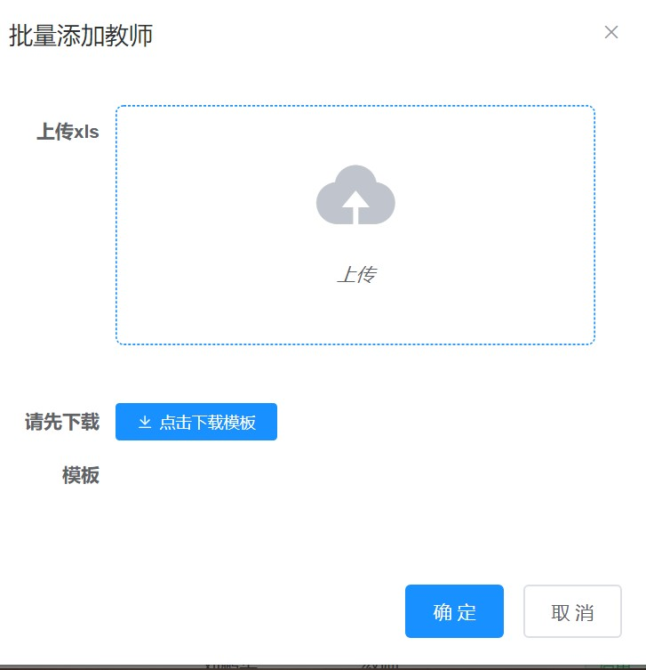

前端对xls文件上传之前进行验证判断，如果格式无误在发送请求

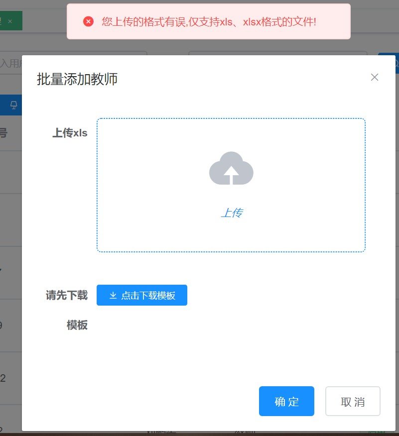

#### 5.修改权限

权限组件在前端src->view->system->role文件夹下index.vue

更改权限以后用户登出以后在进入看不见对应的界面，在其他页面通过自定义指令v-permisson实现

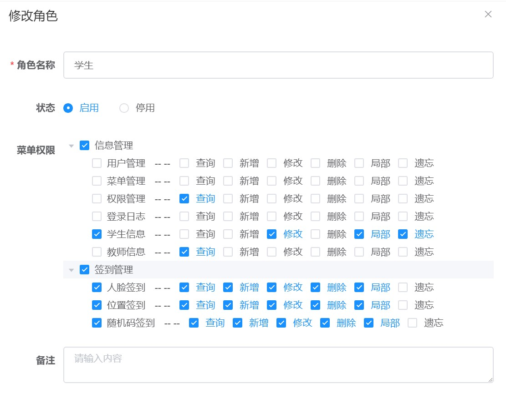

### (2)teacher

#### 0.登陆首页


#### 1.查看信息

隐藏查询框，获取到vuex中的role_name如果为教师，会发起一次请求,将vuex中的user_id传递到接口api(user_id、 stu_id 、tea_id 是共用的)，获取单个教师信息info，教师和学生绑定了多对多关系，学生信息在结果中也会一并返回

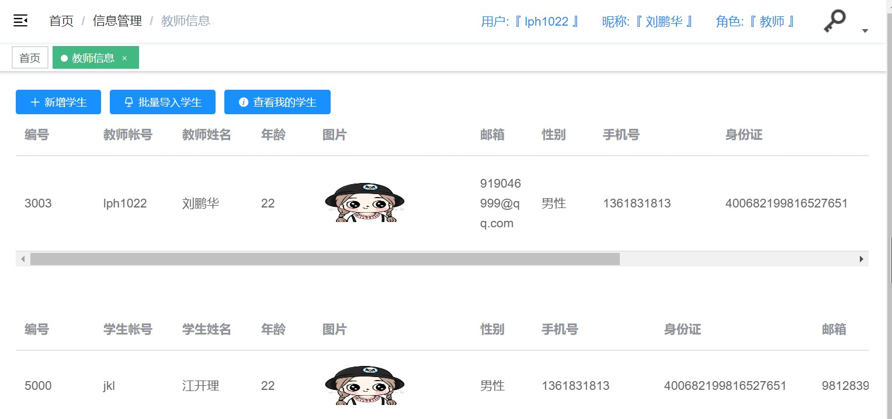

#### 2.单个添加学生信息

添加学生信息时，密码默认为文本123，也可以在this.form='addstudent'内进行更改，与此同时需要将当前用户id从vuex中获取（即教师id）也一起发送，做教师-学生绑定

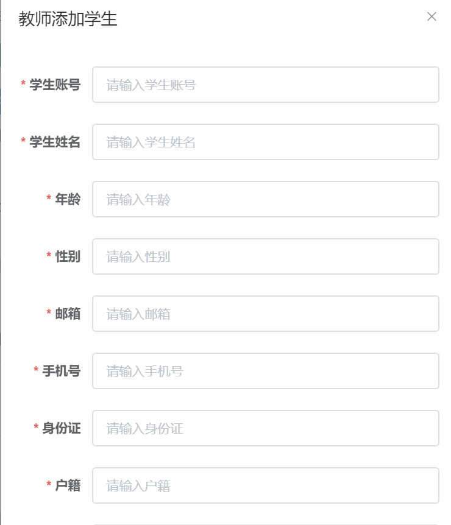

#### 3.批量添加学生信息

仍然需要先下载模板，但是模板中新增了一个字段为tea_name,是教师登陆的账号，后端接受到xls文件转换为多个json对象的数组,通过tea_name找到教师tea_id  将学生们与教师进行tea-stu绑定

批量导入学生信息涉及的表：    学生信息表（添加信息）   教师信息表（通过教师账号查找到教师id）   学生-教师表(多对多关系添加教师id和学生id记录)   用户登陆表（学生登陆系统）   用户-角色表（赋予登陆的学生权限为学生）

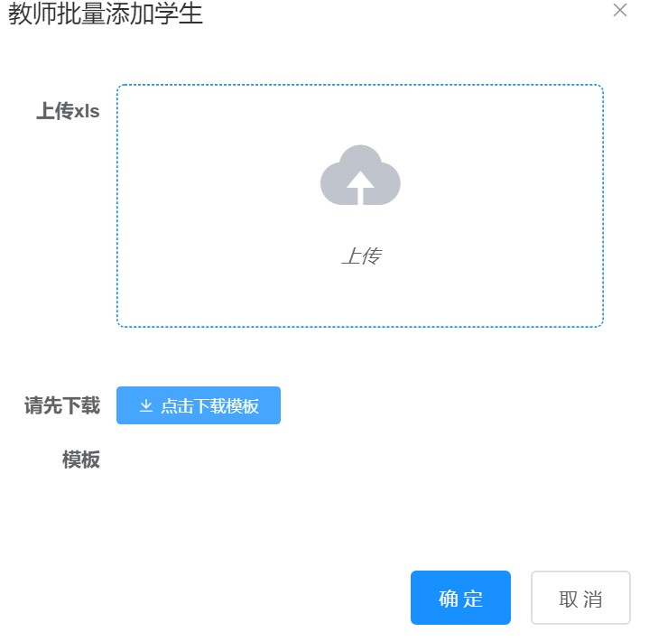

#### 4.个人用户修改密码

初始登陆系统时的密码比较简陋，可以在这个界面修改密码，且初次进入系统有提示需要修改密码

教师/学生输入的原密码会加密后与数据库中加密的密码进行比对，比对成功才能够修改密码，修改信息后需要诚信登陆

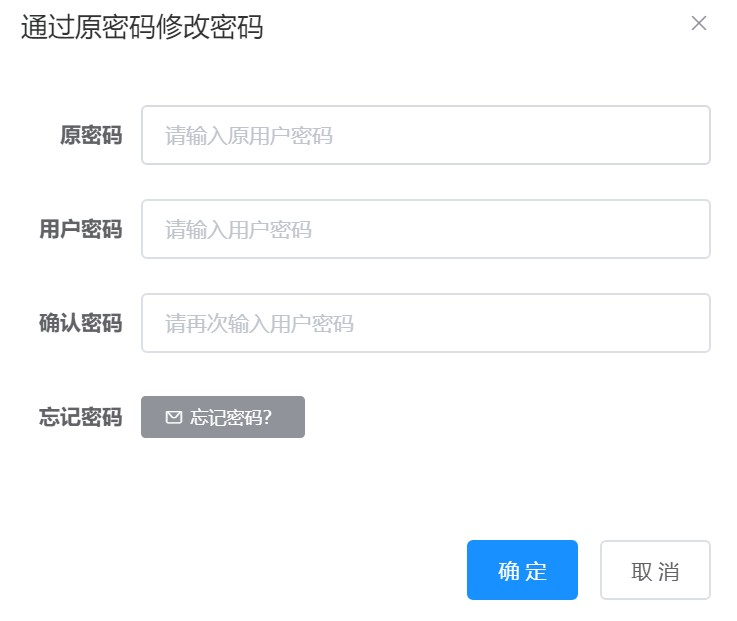

#### 5.用户通过邮箱验证码重置密码

教师/学生录入信息时需要填写邮箱，邮箱（用户登陆时存储在vuex中获取）此时可以用来接受邮件，系统随机生成验证码并保存一份到当前登陆用户（vuex中获取）到数据库中，并将生成的验证码通过绑定邮箱发送给用户，将用户填写的验证码与刚刚随机生成保存在数据库的验证码进行比对，比对成功可以重置密码并加密保存在数据库中，修改后需要重新登陆


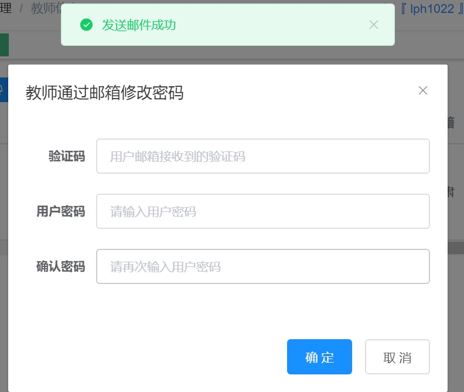

#### 6.教师修改个人信息

修改信息后需要重新登陆，主要需要修改的是邮箱信息

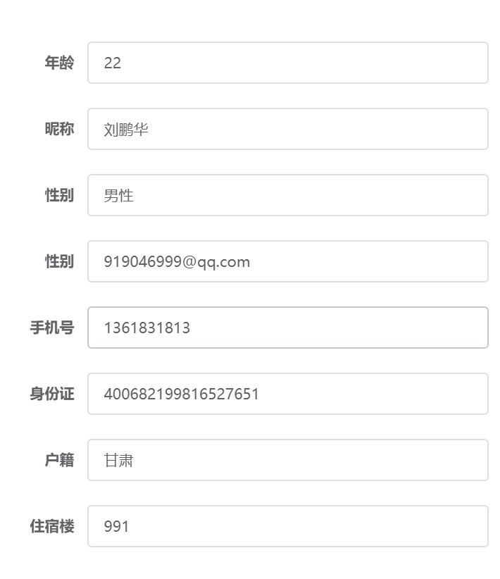


### （3）student

#### 1.查看个人信息

隐藏了查询框，获取到vuex中的role_name如果为学生，那么会发起一次请求,将vuex中的user_id传递到接口api(user_id stu_id tea_id 是共用的)，获取单个学生信息info，教师和学生绑定了多对多关系，教师信息在结果中也会一并返回

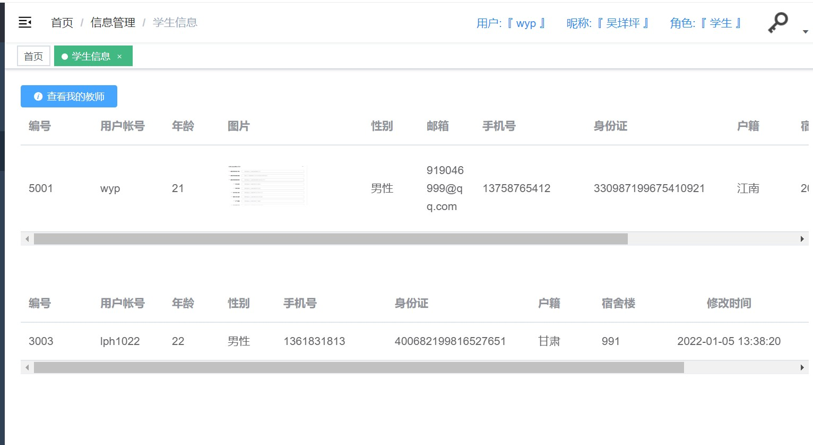

#### 2.修改个人信息/修改密码/邮箱重置密码

修改信息后需要重新登陆，主要需要修改的是邮箱信息，修改密码和邮箱重置密码功能相同，不再赘述


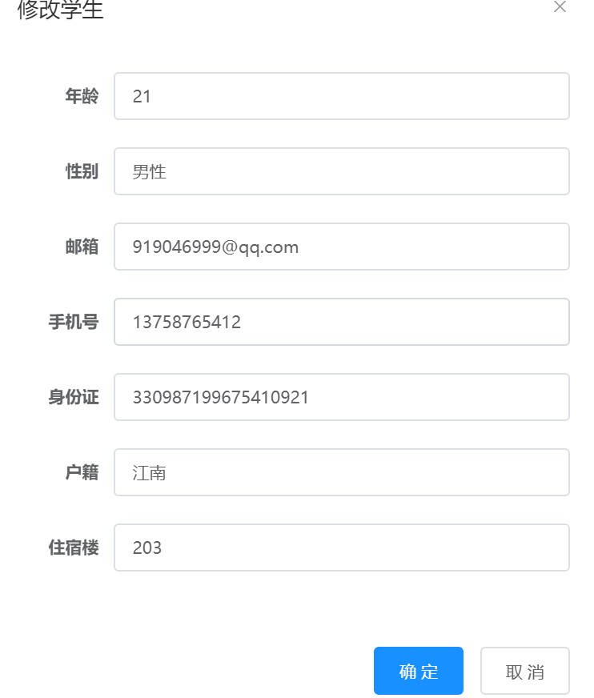

#### 3.上传图片/修改人脸图片数据

教师/学生点击上传图片按钮，会向后端发送一次请求，上传之前会判断图片是否是图片格式，格式不对的话会停止上传，上传需要传递两个参数

1是学生登陆系统的账号名

2是学生登陆的用户id

后端使用formidable接收文件，设置文件上传路径，保留后缀名，文件成功上传到目标文件夹后，

将文件重命名为学生登陆的系统账号.jpg   例如wyp233.jpg  wjj.jpg

并将保存静态文件的目录打开，将文件重命名后赋值通过静态资源的方式可以通过url访问，并将最终的文件路径重命名后存在学生表stu_pic字段中（"http://127.0.0.1:8002/public/images/face/xxx.jpg"）

#### 4.进行人脸签到

签到分为两种，一种是签到成功，一种是签到失败，签到模块前端使用video捕获摄像头打开后的视频信息，当学生点击签到识别，使用canvas将视频截取并且转换成图片格式，需要传递三个参数

1是刚刚使用canvas生成的图片   

2是用户的账号姓名  （vuex）

3是用户登陆的Id   (vuex)

人脸识别后端使用的是百度人脸识别离线sdk,填写相关appid,key信息之后即可使用，用来比对两张人脸的相似度获得阈值，阈值通过则签到成功，阈值不通过签到失败，我定义的阈值是85

获取到用户的账号名，去读取静态资源图片目录下的当前用户jpg文件（学生在上传图片时图片会被重命名为学生登陆系统的账号.jpg），将当前登陆用户的jp图片转换成base64格式

前端通过摄像头传递的图片也转换成base64格式后，将两张图片进行比对，会获得一个分数阈值

签到成功则往签到记录表中插入一条记录，阈值不通过则不插入，同时提示用户错误信息

##### 签到成功！

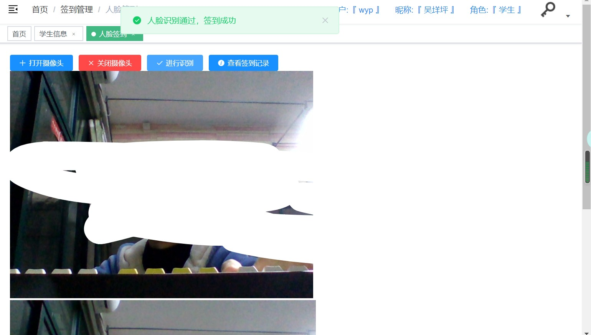

##### 签到失败！

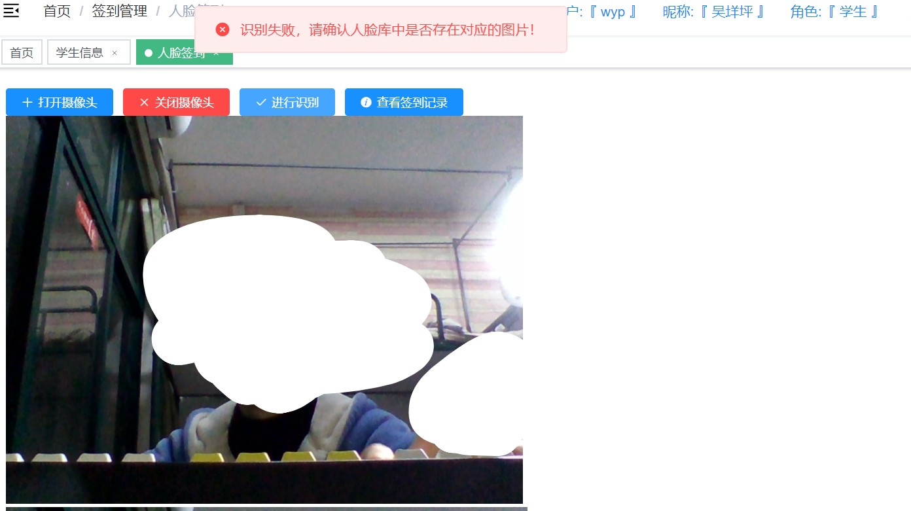

##### 查看签到记录！

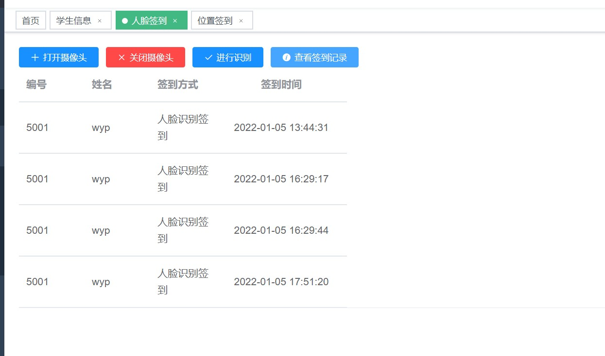

